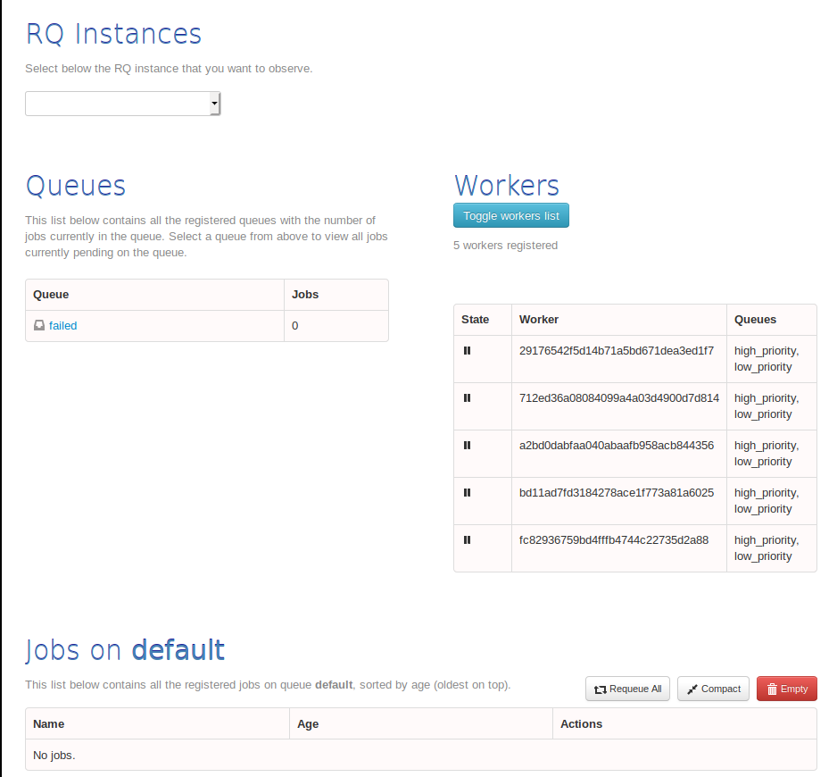

# rq-docker-supervisor
Minimal example/template of how to start rq workers in docker containers using supervisor.

## Prerequisites
- Install [docker CE](https://docs.docker.com/v17.09/engine/installation/)
- Install [docker-compose](https://docs.docker.com/compose/install/)
- Use UNIX-like operating system

## What is RQ?
RQ is a Python library for queuing jobs and processing them in the background with workers.

See [https://python-rq.org/](https://python-rq.org/) for full details.

## What is supervisor?
Supervisor is a client/server system that allows control of a number of processes on UNIX-like operating systems.

See [http://supervisord.org/introduction.html](http://supervisord.org/introduction.html) for full details.

## Running the containers
Simply run the following:

`docker-compose build`

`docker-compose up`

You can verify everything is working by visiting `localhost:9181`.

You should see something similar to the following:

